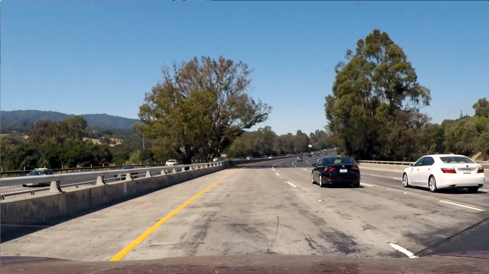
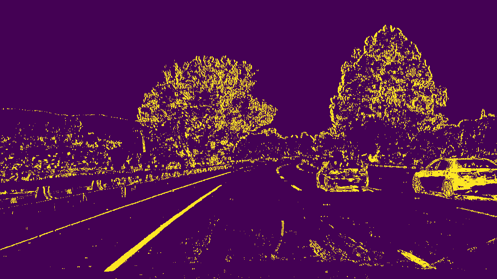
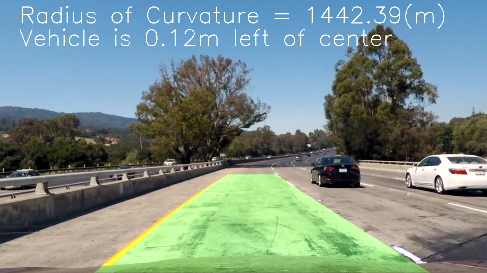

## Advanced Lane Finding Project

The goals / steps of this project are the following:

* Compute the camera calibration matrix and distortion coefficients given a set of chessboard images.
* Apply a distortion correction to raw images.
* Use color transforms, gradients, etc., to create a thresholded binary image.
* Apply a perspective transform to rectify binary image ("birds-eye view").
* Detect lane pixels and fit to find the lane boundary.
* Determine the curvature of the lane and vehicle position with respect to center.
* Warp the detected lane boundaries back onto the original image.
* Output visual display of the lane boundaries and numerical estimation of lane curvature and vehicle position.

### Camera Calibration

The code for this step is contained in the second code cell of the IPython notebook located in "CarND-Advanced-Lane-Lines.ipynb".  

I start by preparing "object points", which will be the (x, y, z) coordinates of the chessboard corners in the world. Here I am assuming the chessboard is fixed on the (x, y) plane at z=0, such that the object points are the same for each calibration image.  Thus, `object_points` is just a replicated array of coordinates, and `obj_points` will be appended with a copy of it every time I successfully detect all chessboard corners in a test image.  `image_points` will be appended with the (x, y) pixel position of each of the corners in the image plane with each successful chessboard detection.  

I then used the output `object_points` and `image_points` to compute the camera calibration and distortion coefficients using the `cv2.calibrateCamera()` function.

### Pipeline (single images)

#### 1. Apply a distortion correction to raw images.

I applied this distortion correction to the test image using the `cv2.undistort()` function using `mtx` and `dist` obtained during camera calibration step.

Original image:



Undistorted image:


#### 2. Use color transforms, gradients, etc., to create a thresholded binary image.

The code for this step is contained in the third code cell of the IPython notebook located in "CarND-Advanced-Lane-Lines.ipynb" in function `color_and_gradient_thresholding`.

I used a combination of color and gradient thresholds to generate a binary image. The color treshhold was calculated besed and s channel and the gradient is based on Sobel operator over l channel.

Undistorted image:


Tresholded image:



#### 3. Apply a perspective transform to rectify binary image ("birds-eye view").

The code for this step is contained in the fourth code cell of the IPython notebook located in "CarND-Advanced-Lane-Lines.ipynb" in function `perspective_transformation`.

The code for my perspective transform includes a creation of an array of source (`src`) and destination (`dst`) points passed to `getPerspectiveTransform` to get transform matrix `M` and inverse transform matrix `Minv`. `M` is used to warp the tresholded image for lane detection. `Minv` is returned to be used to warp the image back once lane has been detected.

```python
    src = np.float32([
        [(width / 2) - 60, height / 2 + 100], # top left
        [(width / 6) - 20, height],           # bottom left
        [(width * 5 / 6) + 60, height],       # bottom right
        [(width / 2) + 70, height / 2 + 100]  # top right
    ])
    
    dst = np.float32([
        [(width / 4), 0],                     # top left
        [(width / 4), height],                # bottom left
        [(width * 3 / 4), height],            # bottom right
        [(width * 3 / 4), 0]                  # top right
    ])
```

This resulted in the following source and destination points:

| Source        | Destination   | 
|:-------------:|:-------------:| 
| 580, 460      | 320, 0        | 
| 193, 720      | 320, 720      |
| 1126, 720     | 960, 720      |
| 710, 460      | 960, 0        |

Tresholded image:


Warped image:


#### 4. Detect lane pixels and fit to find the lane boundary.

The code for this step is contained in the fifth code cell of the IPython notebook located in "CarND-Advanced-Lane-Lines.ipynb" in functions `find_lane_pixels`, `fit_polynomial` and `search_around_poly`.

The `find_lane_pixels` function is taking histogram of the bottom half of the image detect peaks of the left and right halves and then move upward in the image saving x and y positions of the found lines.

The `fit_polynomial` function is taking left and right x and y coordinates to fit a polynomial and discover the lane boundaries. The sunction also paints the left lane boundary red, right boundary blue and discovered lane yellow. 5 last found fits are stored in `left_fits` and `right_fits`, but only if current for is not widly different from the mean of already stored 5.

The `search_around_poly` function is used when the polynomial fit has been found at least once to not waste resources in running `find_lane_pixels` again. It uses a mean of fits stored in `left_fits` and `right_fits`.

Warped image:


Warped image with lane marked:


#### 5. Determine the curvature of the lane and vehicle position with respect to center.

The code for this step is contained in the sixth code cell of the IPython notebook located in "CarND-Advanced-Lane-Lines.ipynb" in functions `curvature_and_offset`.

The function transforms pixel to meters using `30/720` for y dimension and `3.7/600` for x. Using the new points it fits a polynomial and uses the A, B, and C values to calculate left and right radius of curvature. The offset is calculated by averaging left and right 0 points from both polynomials to get the center of a lane and then comparing that to center of the image. 10 last computed radius and offset is stored in `curvatures` and `offsets`.

#### 6. Warp the detected lane boundaries back onto the original image.

The code for this step is contained in the seventh code cell of the IPython notebook located in "CarND-Advanced-Lane-Lines.ipynb" in function `detect_lines` which is the main pipeline function in line.

The function `cv2.warpPerspective` uses `Minv` matrix calculated during step 3 in `perspective_transformation` function.

Warped image with lane marked:


Unwarped image with lane marked:


#### 7. Output visual display of the lane boundaries and numerical estimation of lane curvature and vehicle position.

The code for this step is contained in the seventh code cell of the IPython notebook located in "CarND-Advanced-Lane-Lines.ipynb" in function `detect_lines` which is the main pipeline function in line.

The function `cv2.addWeighted` applies detected and unwarped `lanes` image prepared during step 6 on the undistorted original image. Mean of last computed offsets and curvatures calculated in step 5 are displayed on the image using `cv2.putText`.

Undistorted image:


Output image with lane boundaries and curvature/posision:



### Pipeline (video)

[project_video_lanes.mp4](./project_video_lanes.mp4)

---

### Discussion

#### 1. Low contrast between lane boundary and the road (fixed)

~~The current approach does not work well with low contrast scenarios between the road yellow marking and the road iself. The major reason for it is that I am trying to recalculate the lane position for each frame and not used saved values from previous frames to stabilize the image.~~

Old image:


Fixed version:


#### 2. Multicolored road

If the road is multicored/patched the lane discovery function might shift from lane markings to the middle of the lane, since this point will have higher gradient thresholds. This isse can be solved bu using tigher starting window and stabilisation of lane boudaries between frames.


